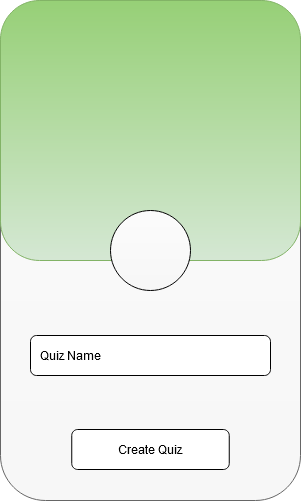
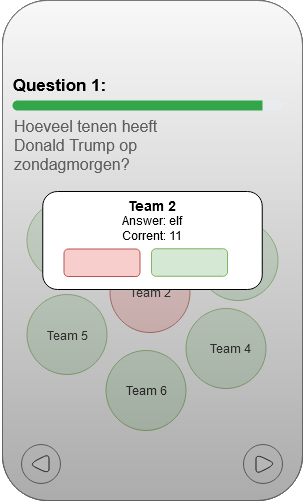
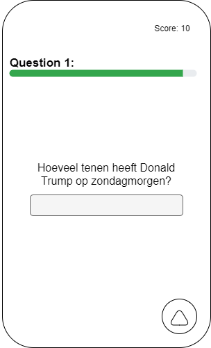

# PUB Quiz - Web Application

The Quizzer is a web application that can be used in bars, sports canteens and maybe even prisons to play quizzes as a team. A pub quiz, basically.

---

## Included libraries

The following libraries are used by and included in the extension as-is:

- React: [https://reactjs.org/](https://reactjs.org/)
- Webpack: [https://webpack.js.org/](https://webpack.js.org/)
- Bootstrap from Twitter: [http://twitter.github.com/bootstrap/](http://twitter.github.com/bootstrap/)
- Font Awesome: [http://fontawesome.io/](http://fontawesome.io/)

---

## Authors

- Evren Kilic: [https://github.com/EvrenKilic](https://github.com/EvrenKilic)
- Tim Beeren: [https://github.com/TBeeren](https://github.com/TBeeren)

---

## Documentation
- REST API Specification: [REST_API_Specification.md](./doc/rest_api.md)
- Web Socket Specification: [Web_Socket_Specification.md](./doc/websocket_specification.md)

---

## Wireframes 
The wireframe are meant to demonstrates what interface elements that exist on key pages will look like.

### Quiz Master
The annotated wireframes can be seen in [the annotation folder](https://github.com/HANICA-DWA/sep2020-quizz-tim-evren/tree/main/assets/Master/img/annotations)

---

### Team
The annotated wireframes can be seen in [the annotation folder](https://github.com/HANICA-DWA/sep2020-quizz-tim-evren/tree/main/assets/Team/img/annotations)

---

### Scoreboard
The annotated wireframes can be seen in [the annotation folder](https://github.com/HANICA-DWA/sep2020-quizz-tim-evren/tree/main/assets/Score/img/annotations)

---
